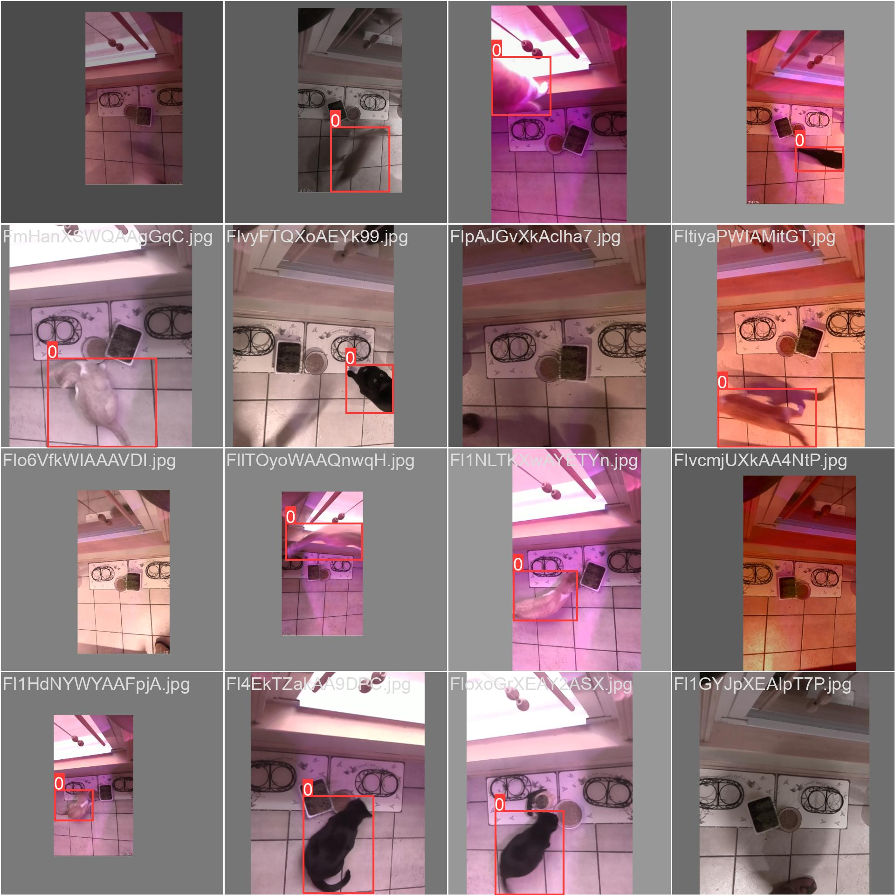

# catfoodtime
Uses object detection to see if there's actually a cat in the photo

# Setup / Training

1. Create a python virtual environment `python -m venv ./.venv`
1. Activate virtual environment `source .venv/bin/activate`
1. Install prerequisites. `pip install -r requirements.txt`
1. Split source_data images into training/test/validation by running `./split_data.py`
1. Train your model on the split data
   `yolo task=detect mode=train model=yolov8n.pt data=yolo-custom.yaml epochs=20 lr0=0.01 imgsz=640`

   This may take a long time if you don't have an nvidia gpu, you can tinker with `epochs` to shorten run time.

1. Look in runs/detect/train at the output You should find something like this
   showing how training went.

   

# Detection
1. Activate the virtual environment if it's not already
1. Run replace the training run and source in the following command and run: `yolo task=detect mode=predict model="runs/detect/<training run>/weights/best.pt" source="<image>" save_txt=True conf=0.07`
  
   You may need to tinker with `conf` in the above command.

   Then take a look in runs/detect/predict\<N\> to see results

# Labeling Data

There's probably not enough labeled data in this repository. You should be able to
add more by saving more images to `source_data`, labeling them with labelImg,
saving the labels in YOLO format. Then rerun the `split_data.py` and training.

You can install labelImg with `pip install labelImg` I didn't include it in requirements.txt because
it's not necessary for running yolo.